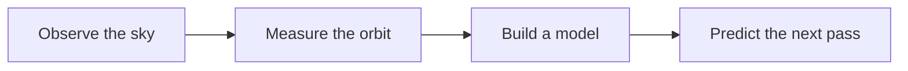
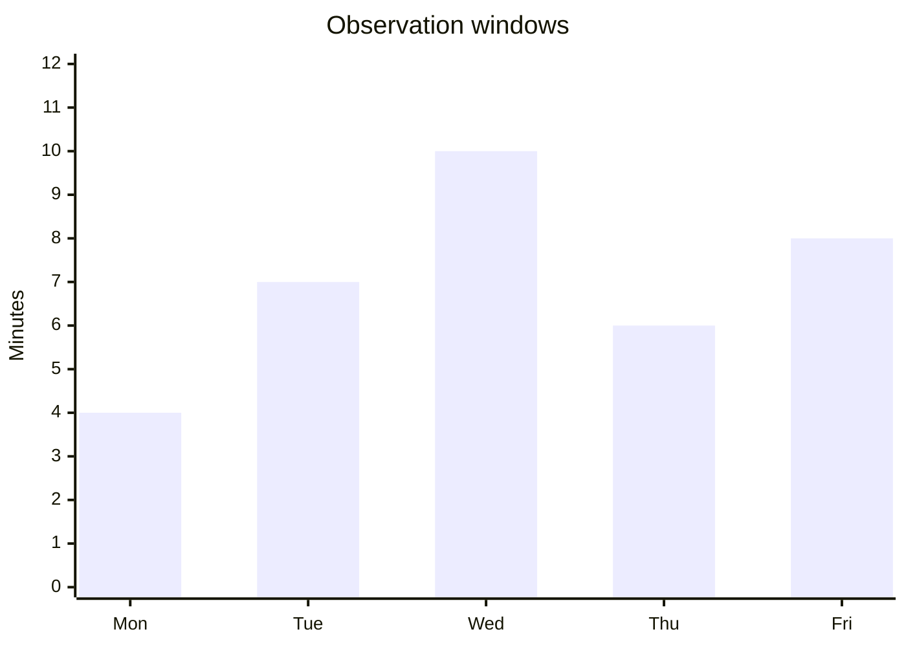

# Earth, in perspective

*A field guide to seeing the whole — and reading the detail.*

From orbit, the planet is a sweep of blue. Closer to the surface, that sweep
becomes cloud, coastline and weather. The same document can carry the photograph,
the equation and the explanation.

{width=80% align=center caption="Earth from orbit · Photography from Unsplash"}

Read more: [NASA](https://www.nasa.gov/) · [Wikipedia](https://en.wikipedia.org/wiki/Earth)

## The shape of an orbit

Gravity links a satellite's period $T$ to its orbital radius $r$:

$$
T = 2\pi\sqrt{\frac{r^3}{GM}}
$$

<blockquote>
A useful model keeps the relationships clear without losing the details.
</blockquote>

## Time above the horizon

Illustrative observation windows, in minutes:

| View | What to notice |
|:--|:--|
| From orbit | Atmosphere, curvature and cloud systems |
| From the ground | Direction, elevation and changing light |
| Through a model | Relationships between distance, mass and time |

<strong>Start with the whole.</strong> Then follow the structure: a photograph,
a graph and an equation each reveal a different part of the same story.

[Back to the beginning](#earth-in-perspective)
